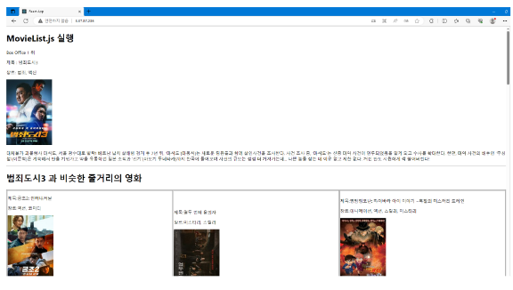

"# docker\_-movie-commend-project"

### 영화 추천 시스템 결과 페이지

##### 웹페이지 개발 이야기

강사님께서 영화제목이 있는 csv파일을 제공해주셨다.

1. 해당파일을 기반으로 네이버에서 크롤링을 하기 (Selenium 및 BeautifulSoup4 사용)

2. AWS RDS와 MySQL 연결하기 (PyMySQL 사용)

3. 한국어 텍스트 데이터를 단어로 분할 하고 각 단어의 형태소를 분석하기(konlpy라이브러리 중 하나인 Twitter 사용)

4. 벡터화 및 유사성 검사하기(work2vec,유클리드 거리 사용)

5. Flask Rest 서버 구축하기(강사님과 함께 진행)

6. Spring Boot 백엔드와 연동하여 클라이언트 애플리케이션과 데이터베이스 간의 상호작용을 구현 (강사님과 함께 진행)

7. AWS EC2 클라우드 인스턴스를 활용하여 배포하기

위와 같이 개인적으로 주어진 카테고리를 따라 프로젝트를 진행할 수 있는 기간을 충분히 주신 후 이후에 리뷰시간을 가졌습니다.
